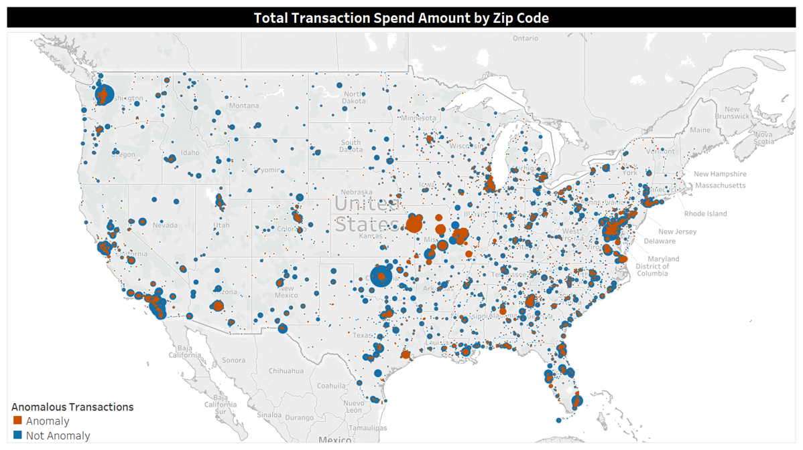
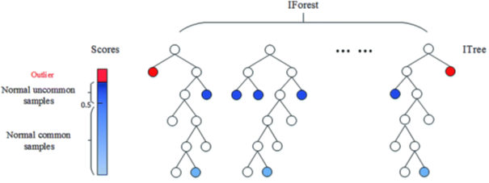
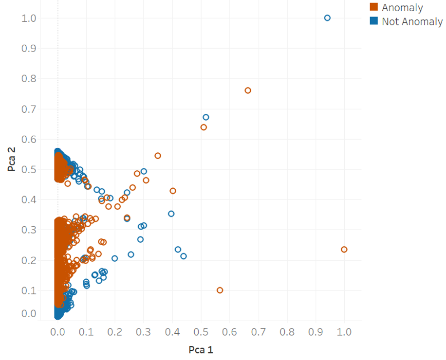
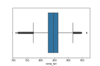
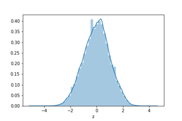

# Transaction-Fraud-Detector
Unsupervised machine learning POC to demonstrate use of compression and isolation forest algorithms in detecting anomalies in financial transactions.

## Objectives
Reviewing transactions individually to find waste, abuse, and underutilization is an extremely labor intensive and error prone process.
* Need automated, statistically unbiased solution for identifying patterns of transactions using all input variables.
* Identify patterns of Waste, Abuse, and Utilization Opportunities via Anomaly Detection.

## Data Set
For the POC we used obfuscated purchase card data from several agencies. You can load your own data using [Upload Script](gzip.py)

## Technical Overview
Anomaly detection helps us find underlying patterns within transaction data to streamline the review process and validate card controls. This POC combines two different unsupervised learning techniques. Each algorithm works differently to flag a transaction as anomalous if it is different than the average transaction based on everything we know about it. 

### Isolation Forest
Isolation forest is an unsupervised learning algorithm for anomaly detection that works on the principle of isolating anomalies,[1] instead of the most common techniques of profiling normal points.
* Set desired percentage of anomalies to identify.
* Run through automated algorithm to capture all relationships.
* Label negative anomaly scores as anomalies.
* [Isolation Forest Model](Iso_Forest.py)

Plot of Transactions Across Principal Components 

### Compression Algorithm
Lossless compression is a class of data compression algorithms that allows the original data to be perfectly reconstructed from the compressed data. By contrast, lossy compression permits reconstruction only of an approximation of the original data, though usually with greatly improved compression rates (and therefore reduced media sizes). We can employ lossless compression for measuring the information quantity, and detects outliers according to compression result.
* Compress each row of transaction data (similar to file compression).
* Compare and normalize distances created to identify outliers.
* Label anomalies as those greater than 3 σ above the mean. 
* [Compression Algorithm](gzip.py)

Box Plot of Compressed Transaction Length 

Z-Score Distribution of Compressed Transaction Length 

Compression algorithm found a different subset of transactions for review with some similar patterns (e.g., higher percentage of Travel purchases relative to proportion of overall transactions) 

